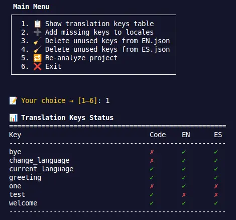

# 🛠️ Installation and Usage of the Analyzer

This project includes a script called `analizer.ts` that helps analyze and keep your i18n translation files clean and synchronized.



## 📌 Prerequisites

- Node.js **v18 or higher**
- A package manager like `npm` or `yarn`

---

## 🔧 Step 1: Install dependencies

Inside the project directory, run:

```bash
npm install
# or
yarn install
```

This will install everything needed to use both the analyzer and the project's development environment (Vite, Tailwind, React, ESLint, etc.).

## 📌 Step 2: Run the i18n analyzer

Once dependencies are installed, you can start the interactive script with:

```bash
npm install
# or
yarn install
```

This runs the analizer.ts file using tsx, allowing you to:

- View keys used in code vs those present in en.json and es.json

- Add missing keys

- Delete unused keys

- Re-analyze the project from the interactive menu

## 📁 Expected structure for the analyzer to work correctly

```bash
your-project/
├── src/
│   ├── locales/
│   │   ├── en.json
│   │   └── es.json
│   └── (source files: .ts/.tsx/.js/.jsx)
├── analizer.ts
└── package.json

```

✅ The analyzer automatically detects the locales folder (src/locales) and scans all source files under src
